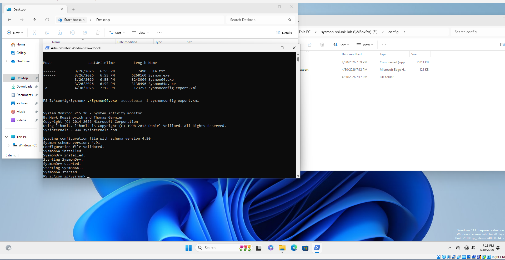
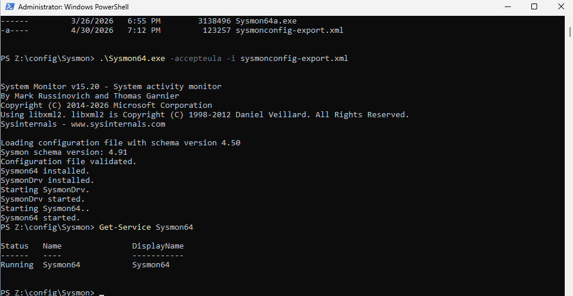
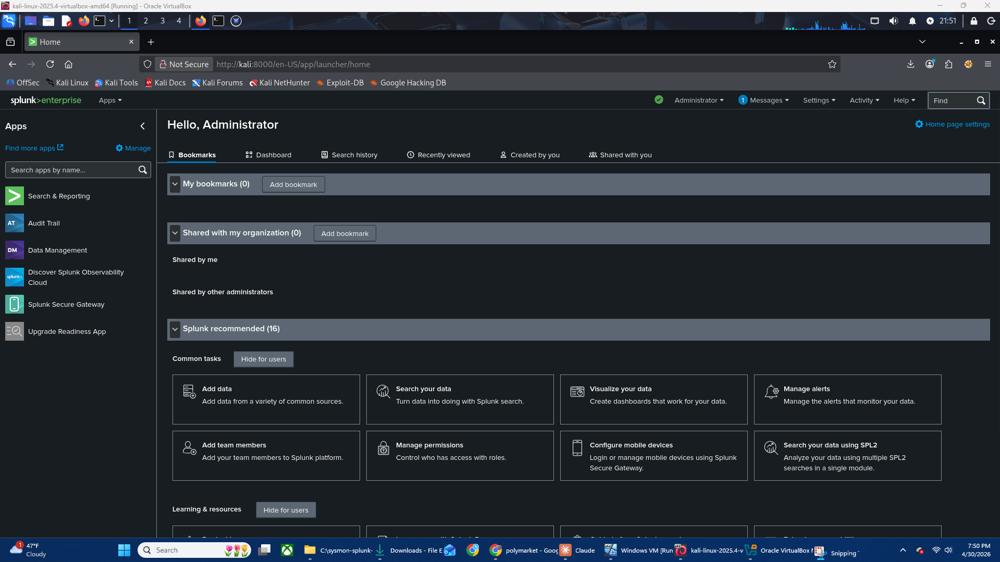
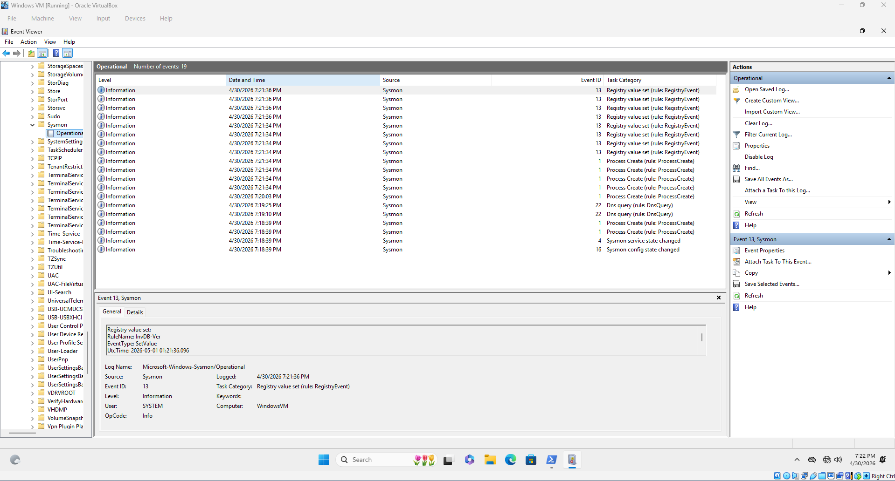
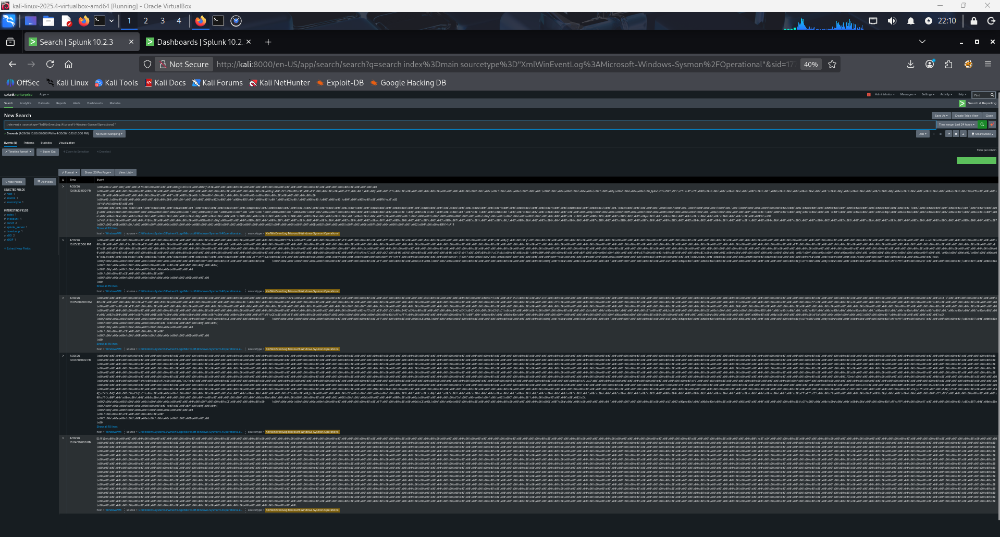
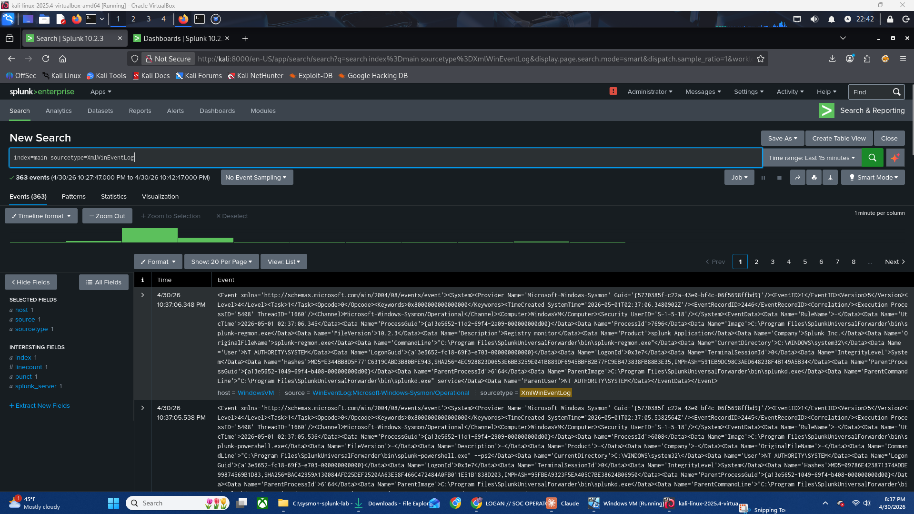
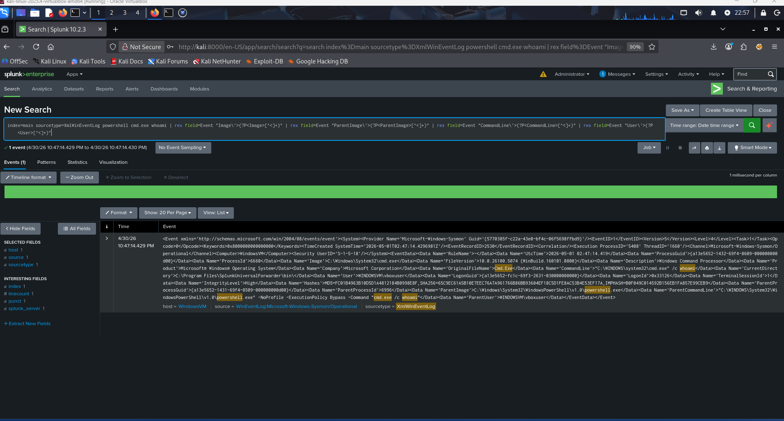

# 🔵 Windows Threat Detection Lab — Sysmon + Splunk


> A home lab simulating a real SOC detection pipeline — suspicious process execution captured by Sysmon, forwarded to Splunk via Universal Forwarder, and hunted using SPL queries.

---

## 📋 Overview

This lab demonstrates a functional threat detection pipeline built from scratch using free tools. The goal was to simulate attacker behavior on a Windows endpoint, capture it with Sysmon, and detect it in Splunk — the same workflow used in real SOC environments.

**Attack simulated:** `powershell.exe` spawning `cmd.exe` to run `whoami` — a classic reconnaissance technique and common indicator of compromise.

---

## 🏗️ Lab Architecture

| Component | Details |
|---|---|
| **Attacker/SIEM Host** | Kali Linux — Splunk Enterprise 10.2.3 |
| **Target/Endpoint** | Windows 11 Enterprise (90-day eval) |
| **Log Collector** | Sysmon v15.20 + SwiftOnSecurity config |
| **Log Forwarder** | Splunk Universal Forwarder 10.2.3 |
| **Network** | VirtualBox Host-Only (isolated, no internet) |
| **Kali IP** | 192.168.56.102 |
| **Windows IP** | 192.168.56.101 |

## 🛠️ Setup

### Step 1 — Windows 11 VM
- Downloaded Windows 11 Enterprise 90-day eval ISO from Microsoft Evaluation Center
- Created VirtualBox VM: 4GB RAM, 50GB disk
- Network adapter set to **Host-Only** (isolated from internet)
- Installed VirtualBox Guest Additions for display scaling and clipboard sharing



---

### Step 2 — Sysmon Installation
- Downloaded Sysmon v15.20 from Microsoft Sysinternals
- Downloaded SwiftOnSecurity config (`sysmonconfig-export.xml`) from GitHub
- Transferred files to VM via VirtualBox Shared Folder
- Installed via Admin PowerShell:

```powershell
.\Sysmon64.exe -accepteula -i sysmonconfig-export.xml
```

- Verified service running:

```powershell
Get-Service Sysmon64
```




---

### Step 3 — Verify Sysmon Logging
Confirmed Event ID 1 (Process Create), Event ID 13 (Registry), and Event ID 22 (DNS Query) appearing in Event Viewer immediately after install.

`Applications and Services Logs → Microsoft → Windows → Sysmon → Operational`



---

### Step 4 — Splunk on Kali
- Downloaded Splunk Enterprise 10.2.3 (.deb) from splunk.com
- Installed and started:

```bash
sudo dpkg -i splunk-10.2.3-4d61cf8a5c0c-linux-amd64.deb
sudo /opt/splunk/bin/splunk start --accept-license --run-as-root
```

- Configured receiving port **9997** via Settings → Forwarding and Receiving



---

### Step 5 — Splunk Universal Forwarder on Windows
- Downloaded Splunk Universal Forwarder 10.2.3 (Windows MSI)
- Installed via GUI, pointed at `192.168.56.102:9997`
- Created `inputs.conf` to monitor Sysmon event log channel:

```ini
[WinEventLog://Microsoft-Windows-Sysmon/Operational]
index = main
sourcetype = XmlWinEventLog
renderXml = true
disabled = false
```

- Changed forwarder service account to `LocalSystem` to resolve access denied error on Sysmon channel
- Verified logs flowing into Splunk



---

## ⚔️ Attack Simulation

### Technique
Simulated a suspicious parent-child process relationship — a common attacker pattern where PowerShell spawns cmd.exe to run reconnaissance commands.

**MITRE ATT&CK Mapping:**
| Tactic | Technique | ID |
|---|---|---|
| Execution | Command and Scripting Interpreter: PowerShell | T1059.001 |
| Discovery | System Owner/User Discovery | T1033 |

### Command Executed
```powershell
powershell.exe -NoProfile -ExecutionPolicy Bypass -Command "cmd.exe /c whoami"
```

### Why This Is Suspicious
- `powershell.exe` spawning `cmd.exe` is a common living-off-the-land technique
- `-ExecutionPolicy Bypass` is a red flag — used to circumvent script restrictions
- `whoami` is a standard first-stage reconnaissance command
- The parent-child chain `powershell → cmd → whoami` is a known IOC pattern

---

## 🔍 Detection in Splunk

### Search Query

index=main sourcetype=XmlWinEventLog powershell cmd.exe whoami

### Results
- **14 matching events** returned
- Full attack chain visible in raw Sysmon XML:
  - `Image: C:\Windows\System32\cmd.exe`
  - `CommandLine: cmd.exe /c whoami`
  - `ParentImage: C:\Windows\System32\WindowsPowerShell\v1.0\powershell.exe`
  - `ParentCommandLine: powershell.exe -NoProfile -ExecutionPolicy Bypass -Command "cmd.exe /c whoami"`
  - `User: WINDOWSVM\vboxuser`



---

## 🔧 Troubleshooting

Several real-world issues were encountered and resolved during this lab — documented here as they reflect genuine operational challenges.

| Issue | Cause | Fix |
|---|---|---|
| Splunk MSI wouldn't install from shared folder | Windows Installer blocks .msi execution from network paths | Copied MSI to local drive first |
| Kali and Windows VM couldn't communicate | Kali only had NAT adapter | Added second Host-Only adapter to Kali |
| Sysmon logs arriving as binary hex garbage | Forwarder was monitoring raw .evtx file | Switched to WinEventLog channel input via inputs.conf |
| `errorCode=5` — access denied on Sysmon channel | Forwarder running as `NT SERVICE\SplunkForwarder` without read rights | Changed service account to `LocalSystem` via `sc.exe config` |
| Field-based SPL searches returning no results | Sysmon Add-on not fully parsing XML fields | Used raw text search; field extraction noted as future improvement |

---

## 💡 Lessons Learned

- **Sysmon is noisy by default** — the SwiftOnSecurity config is essential for filtering signal from noise
- **Log ingestion ≠ parsed fields** — raw XML events require proper sourcetype configuration or an add-on for clean field extraction
- **Service account permissions matter** — a common real-world misconfiguration that silently blocks log collection
- **Host-only networking requires dual adapters** — one for internet (NAT), one for lab isolation (Host-Only)
- **Event Viewer vs Splunk** — Event Viewer renders Sysmon XML natively; Splunk requires configuration to achieve the same structured view

---

## 🚀 Future Improvements

- [ ] Configure Splunk Add-on for Sysmon (TA-microsoft-sysmon) for proper field extraction
- [ ] Build a Splunk dashboard for real-time process monitoring
- [ ] Simulate additional attack techniques (lateral movement, persistence via registry Run key)
- [ ] Add a second Windows VM to simulate lateral movement between hosts
- [ ] Integrate a honeypot (OpenCanary or T-Pot) as a separate detection layer

---

## 🧰 Tools Used

| Tool | Version | Purpose |
|---|---|---|
| VirtualBox | 7.x | VM hypervisor |
| Windows 11 Enterprise | 21H2 eval | Target endpoint |
| Sysmon | v15.20 | Endpoint telemetry |
| SwiftOnSecurity Config | Latest | Sysmon noise filtering |
| Splunk Enterprise | 10.2.3 | SIEM / log analysis |
| Splunk Universal Forwarder | 10.2.3 | Log shipping agent |
| Kali Linux | 2025.4 | Attacker host / SIEM host |

---

## 👤 Author

**Logan Garner**
- 🔗 [LinkedIn](https://linkedin.com/in/logan-garner-368798277)
- 🐱 [GitHub](https://github.com/nagol0618)
- 🎯 [TryHackMe](https://tryhackme.com/p/nagol0618)
